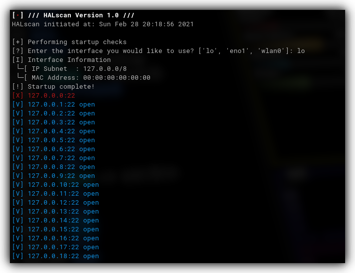

    </img>

<h1 align="center"> <b>HALscan v1.0 by ETN9000</b> </h1>

    
    
    

HALscan is a scanning utility created in Python. It is designed for scanning large subnets in a small amount of time.

### Planned features
- Multithreading
- IPv6 support
- Non-root support
- Visual mapping
- Service fingerprinting
- IDS evasion (detection prevention)

### Preview
</img>